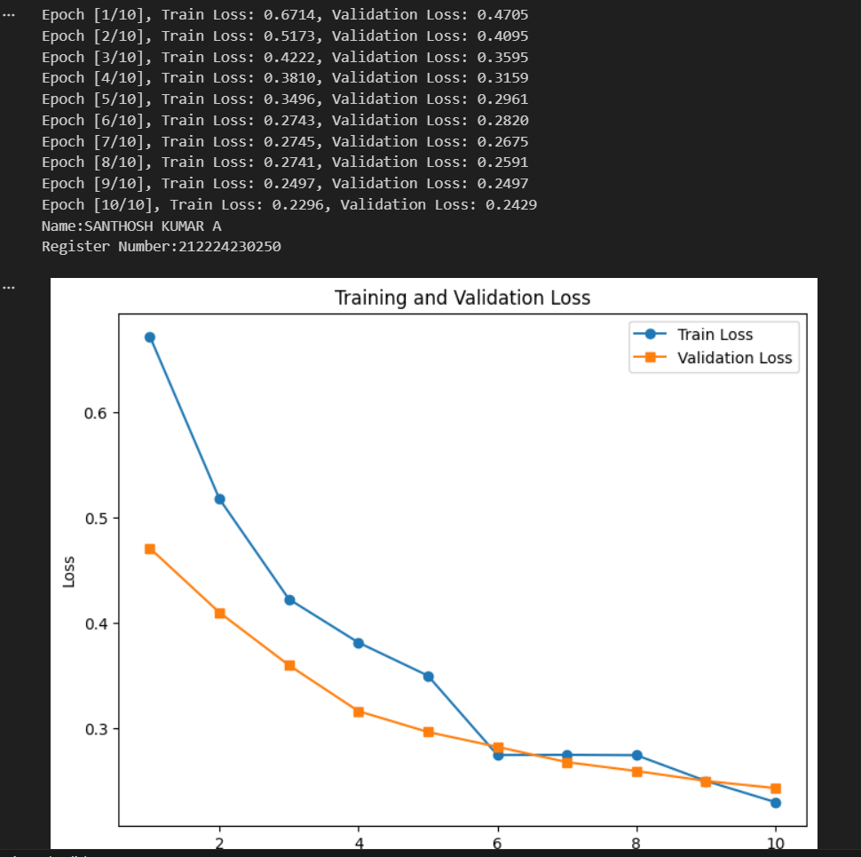
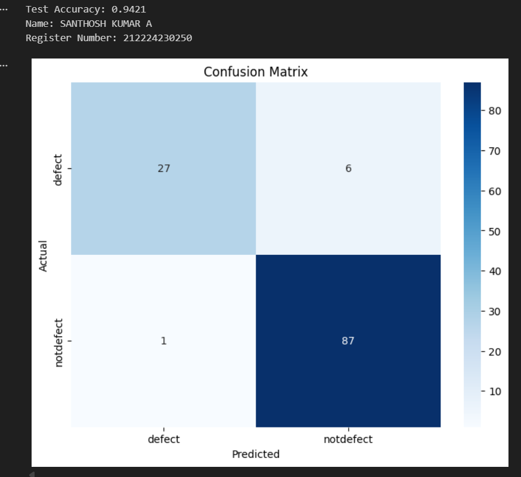
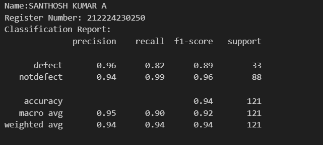
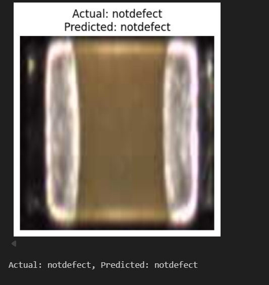
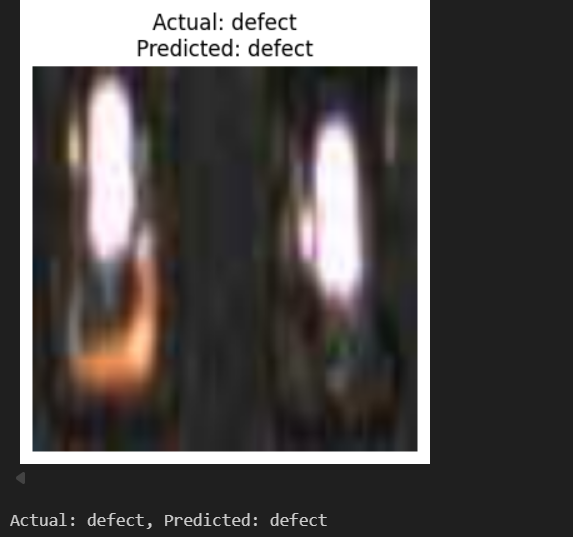

# Implementation-of-Transfer-Learning
## Aim
To Implement Transfer Learning for classification using VGG-19 architecture.
## Problem Statement and Dataset
Include the problem statement and Dataset
</br>
</br>
</br>

## DESIGN STEPS
### STEP 1:
</br>

### STEP 2:
</br>

### STEP 3:

Write your own steps
<br/>

## PROGRAM
Include your code here
```python

# Load Pretrained Model and Modify for Transfer Learning
model = models.vgg19(weights = models.VGG19_Weights.DEFAULT)

for param in model.parameters():
  param.requires_grad = False


# Modify the final fully connected layer to match one binary classes
num_features = model.classifier[-1].in_features
model.classifier[-1] = nn.Linear(num_features,1)


# Include the Loss function and optimizer
criterion = nn.BCELoss()
optimizer = optim.Adam(model.parameters(),lr=0.001)


# Train the model
def train_model(model, train_loader,test_loader,num_epochs=10):
    train_losses = []
    val_losses = []
    model.train()
    for epoch in range(num_epochs):
        running_loss = 0.0
        for images, labels in train_loader:
            images, labels = images.to(device), labels.to(device)
            optimizer.zero_grad()
            outputs = model(images)
            outputs = torch.sigmoid(outputs)
            labels = labels.float().unsqueeze(1)
            loss = criterion(outputs, labels)
            loss.backward()
            optimizer.step()
            running_loss += loss.item()
        train_losses.append(running_loss / len(train_loader))

        # Compute validation loss
        model.eval()
        val_loss = 0.0
        with torch.no_grad():
            for images, labels in test_loader:
                images, labels = images.to(device), labels.to(device)
                outputs = model(images)
                outputs = torch.sigmoid(outputs)
                labels = labels.float().unsqueeze(1)
                loss = criterion(outputs, labels)
                val_loss += loss.item()

        val_losses.append(val_loss / len(test_loader))
        model.train()

        print(f'Epoch [{epoch+1}/{num_epochs}], Train Loss: {train_losses[-1]:.4f}, Validation Loss: {val_losses[-1]:.4f}')

    # Plot training and validation loss
    print("Name: Santhosh Kumar A")
    print("Register Number:212224230250")
    plt.figure(figsize=(8, 6))
    plt.plot(range(1, num_epochs + 1), train_losses, label='Train Loss', marker='o')
    plt.plot(range(1, num_epochs + 1), val_losses, label='Validation Loss', marker='s')
    plt.xlabel('Epochs')
    plt.ylabel('Loss')
    plt.title('Training and Validation Loss')
    plt.legend()
    plt.show()


```

## OUTPUT
### Training Loss, Validation Loss Vs Iteration Plot
Include your plot here


### Confusion Matrix
Include confusion matrix here


### Classification Report
Include Classification Report here


### New Sample Prediction




## Result:
   The VGG-19 model was successfully trained and optimized to classify defected and non-defected capacitors.

